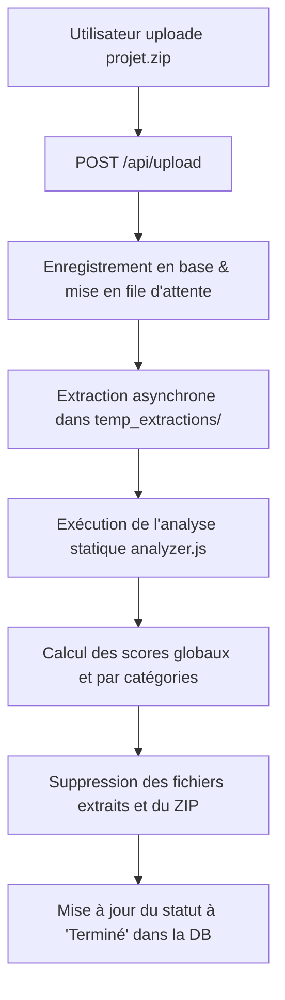

# Fonctionnement de l'Évaluation des Critères RGESN en Backend

Ce document explique en détail comment l'application évalue la conformité d'un projet par rapport aux critères du **RGESN** (Référentiel Général d'Éco-conception de Services Numériques).

---

## 1. Un LLM (Large Language Model) est-il utilisé ?

**Non, aucun LLM n'est utilisé dans cette application.** 

Ce choix de conception repose sur trois piliers fondamentaux de l'éco-conception logicielle (Green IT) :
1. **Sobriété énergétique & Frugalité** : L'appel à des API de LLM ou l'exécution locale de modèles d'IA générative consomme des quantités massives d'énergie et de ressources matérielles. L'analyse se veut ultra-légère et rapide.
2. **Déterminisme** : L'évaluation automatique doit être 100 % reproductible, stable et explicable. Une analyse statique basée sur des règles strictes garantit qu'un même code produira toujours exactement le même score et les mêmes justifications.
3. **Confidentialité et sécurité** : Les projets ZIP téléversés sont analysés localement en mémoire et sur le disque du serveur, sans qu'aucune donnée de code source ne soit envoyée à des tiers.

---

## 2. Workflow global de l'analyse backend

Le processus d'évaluation s'articule autour de quatre fichiers principaux du backend Node.js :
* `server.js` : Point d'entrée HTTP (API Express).
* `queue.js` : File d'attente asynchrone des analyses.
* `analyzer.js` : Moteur d'analyse statique du code source.
* `db.js` : Gestion de l'état persistant (`db_store.json`) et formules de calcul des scores.

Voici le cycle de vie d'un projet téléversé :

### Étape 1 : Réception et mise en file d'attente (`server.js` & `queue.js`)
L'utilisateur dépose l'archive du projet. L'API `POST /api/upload` valide que le fichier est bien au format `.zip` (via `multer`) et crée un projet dans l'historique avec le statut `"En attente"`. Le traitement est délégué à la classe `AnalysisQueue` afin d'éviter la saturation du microprocesseur.

### Étape 2 : Extraction et comptage (`queue.js`)
La file d'attente traite les projets l'un après l'autre. Elle extrait l'archive dans un dossier temporaire nommé avec l'UUID du projet (`temp_extractions/<uuid>/`). Les fichiers sont dénombrés de manière récursive.

### Étape 3 : Analyse Statique (`analyzer.js`)
Le moteur d'analyse statique inspecte le contenu textuel des fichiers du projet (limité aux 200 premiers fichiers pour éviter les dépassements de mémoire) afin d'identifier des patterns précis.

### Étape 4 : Nettoyage immédiat
Afin de limiter l'empreinte de stockage sur le serveur, le dossier temporaire d'extraction ainsi que le fichier ZIP d'origine sont **immédiatement et définitivement supprimés** dès que l'analyse est terminée, que celle-ci ait réussi ou échoué.

---

## 3. Comment les critères sont-ils évalués ?

Le référentiel RGESN comporte des critères de gouvernance, de design, de stratégie et de choix techniques. Certains critères sont purement humains (ex. : formation des équipes) tandis que d'autres sont traduisibles en code.

L'application sépare ainsi les critères en deux types de traitement :

### A. Les critères Manuels (par défaut)
Par défaut, la majorité des critères (accessibilité, hébergement, stratégie globale...) sont initialisés à l'état **"Manuel"** avec la justification : 
> *"Ce critère exige une évaluation humaine ou de gouvernance et ne peut pas être déduit du code source."*

L'utilisateur peut directement modifier cet état depuis l'interface web pour le passer à **Validé**, **Non-Validé** ou **N/A** (Non-Applicable). L'API `POST /api/projects/:id/manual` met à jour ces choix et recalcule dynamiquement le score global.

### B. Les critères Automatisés via l'Analyse Statique
Pour **14 critères spécifiques**, le fichier `analyzer.js` effectue un scan automatisé de fichiers cibles en recherchant des technologies, configurations ou patterns de code.

Voici la liste des règles d'automatisation implémentées :

| Code RGESN | Catégorie | Description du critère | Logique d'analyse automatisée backend |
| :--- | :--- | :--- | :--- |
| **Str5** | Stratégie | Technologies standards vs propriétaires | Analyse `package.json` et `requirements.txt`. Alerte si détection de paquets liés à des technologies obsolètes/fermées (Flash, ActiveX, Silverlight). Échoue si aucun gestionnaire de paquets standard n'est détecté. |
| **Spec1** | Spécifications | Profils de matériels cibles | Valide si présence d'une clé `"browserslist"` (dans `package.json` ou dans un fichier `.browserslistrc`) ou si le README contient des mots-clés liés au support matériel/navigateur (ex. : *hardware*, *configuration requise*). |
| **Spec2** & **Spec3** | Spécifications | Compatibilité anciens terminaux, OS et navigateurs | Analyse les dépendances dans `package.json`. Valide si des outils de compilation et de rétrocompatibilité sont déclarés (ex. : `babel`, `core-js`, `postcss`, `swc`, `tslib`). |
| **Spec4** | Spécifications | Adaptabilité d'affichage (Responsive) | Analyse le code CSS et HTML. Valide si détection de balises `<meta name="viewport">` et de règles responsives (ex. : `@media`, `flexbox`, `grid-layout`). |
| **Spec5** | Spécifications | CI/CD et décommissionnement | Valide si présence de fichiers YAML de workflow ou de fichiers liés à Docker (`Dockerfile`, `docker-compose.yml`), avec recherche bonus de commandes de nettoyage (`clean`, `prune`, `minify`, `rm`). |
| **Uxui1** | UX / UI | Désactivation de la lecture automatique | Parcourt l'HTML et le Javascript à la recherche d'attributs ou d'instructions forçant la lecture automatique de médias (ex. : `<video autoplay>`, `autoplay: true`, `.autoplay = true`). Si trouvé, le critère passe en **Non-Validé**. |
| **Uxui2** | UX / UI | Absence de défilement infini | Détecte dans les scripts JS des patterns de chargement continu liés au scroll (combinaison d'événements de défilement avec `innerHeight`, `scrollHeight`, `scrollTop`) ou des mots-clés comme `infinite-scroll`. Si trouvé, passe en **Non-Validé**. |
| **Uxui3** | UX / UI | Notifications et désactivation | Valide par défaut si aucune API de push ou de notification n'est identifiée. Passe en **Non-Validé** en cas d'utilisation de `Notification.requestPermission` ou `pushManager.subscribe`. |
| **Cont1**, **Cont2**, **Cont3** | Contenus | Vidéos adaptées, compressées et écoute seule | **Non-Applicable (N/A)** par défaut si aucun tag `<video>` n'est présent dans le projet. Sinon, analyse les balises `<source>` multiples (Cont1), les codecs modernes (webm, av1, h265, vp9) (Cont2) et les options ou termes liés à l'écoute seule (Cont3). |
| **Bck2** | Backend | Système de cache serveur | Analyse `package.json` à la recherche de bibliothèques de cache (ex. : `redis`, `memcached`, `cache-manager`, `node-cache`) et recherche des en-têtes HTTP de cache (`Cache-Control`, `max-age`) ou des appels d'API de cache dans le code backend. |
| **Bck3** | Backend | Rétention et archivage des données | Scanne le code source pour y détecter des mécanismes d'archivage automatique ou de suppression des données obsolètes (clés `TTL`, requêtes `deleteMany` ou `DELETE FROM` couplées à des dates, scripts de `purge` ou `cleanup`). |
| **Frnt1** | Frontend | Performance budget | Valide si des outils de contrôle de taille de bundle (ex. : `size-limit`, `bundlewatch`, `webpack-bundle-analyzer`, `lighthouse-ci`) ou des configurations explicites de budget d'actifs (ex. : Webpack `maxAssetSize`) sont configurés. |
| **Frnt2** | Frontend | Cache client & Service Workers | Valide si présence d'un Service Worker (`sw.js`, `navigator.serviceWorker.register`) ou d'appels à la CacheStorage API (`caches.open`). |
| **Algo3** & **Algo6** | Algorithmie | Entraînement ML & Inférence frugale | **Non-Applicable (N/A)** si aucune bibliothèque de Machine Learning (TensorFlow, PyTorch, Keras, Scikit-learn) n'est présente dans les dépendances. Sinon, vérifie l'usage de modèles pré-entraînés ou d'Early Stopping (Algo3) et de formats d'inférence optimisés comme ONNX ou la quantification (Algo6). |

---

## 4. Algorithme de Calcul du Score (`db.js`)

Pour refléter au mieux la démarche d'éco-conception, les scores sont calculés en fonction de la **priorité** et de la **difficulté** de chaque critère :

### Pondération des critères
Chaque critère se voit attribuer une valeur de points théorique maximale calculée ainsi :
$$\text{Points Max d'un critère} = \text{Valeur de Priorité} \times \text{Valeur de Difficulté}$$

Avec les barèmes suivants :
* **Priorité** : 
  * *Prioritaire* = 3 points
  * *Recommandé* = 1 point
* **Difficulté** :
  * *Faible* = 1 point
  * *Moyen* = 2 points
  * *Fort* = 3 points

*Exemple : Un critère "Prioritaire" de difficulté "Forte" vaut au maximum $3 \times 3 = 9$ points.*

### Prise en compte du statut pour le score global
* **Validé** : Le projet obtient les points maximum du critère. Le critère est comptabilisé dans le score maximum.
* **Non-Validé** : Le projet obtient 0 point. Le critère est comptabilisé dans le score maximum (pénalisation).
* **Manuel** : Par défaut, le critère non encore évalué rapporte 0 point mais est comptabilisé dans le score maximum. Cela incite l'utilisateur à déclarer manuellement l'état pour améliorer son score.
* **N/A (Non-Applicable)** : Le critère est **totalement exclu** du calcul (il ne rapporte pas de point et n'augmente pas le score maximum possible).

### Formule du score global

$$\text{Score Global (\%)} = \text{arrondi}\left( \frac{\sum \text{Points obtenus sur les critères applicables}}{\sum \text{Points max théoriques des critères applicables}} \times 100 \right)$$
